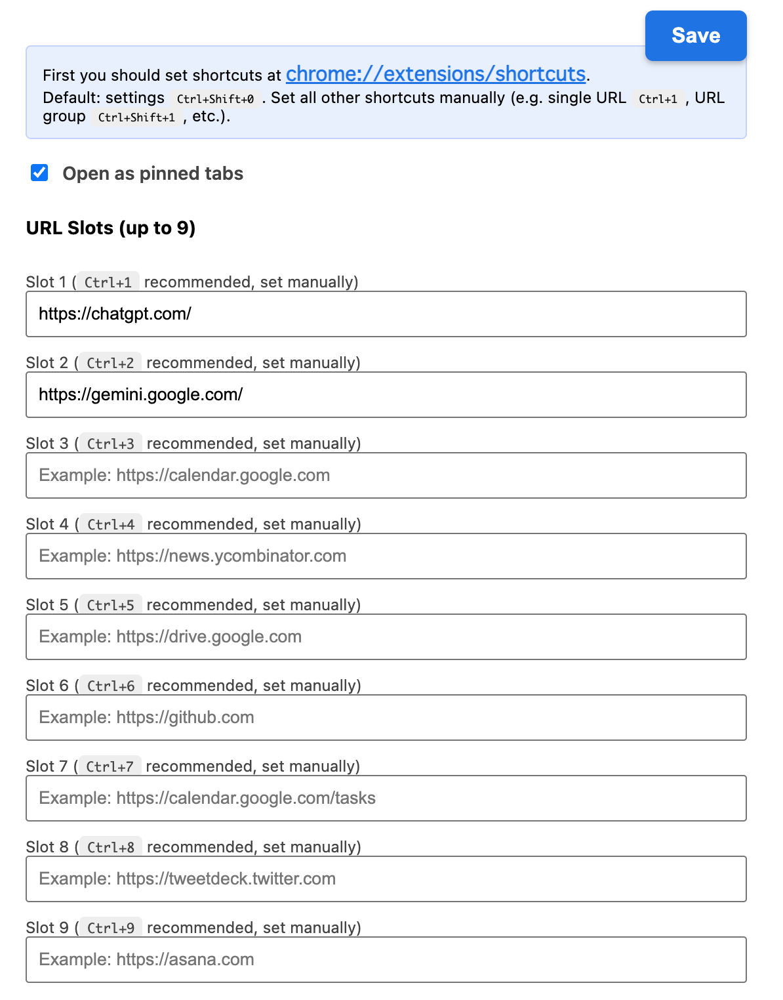

# Quick Tab Opener

[](./LICENSE)

## Overview

Quick Tab Opener lets you open single URLs or preset groups of URLs with customizable keyboard shortcuts so you can jump into your workflow without navigating bookmarks manually.

Example:

- Opens frequently used sites from either slot shortcuts (1–9) or grouped shortcuts.
- Normalizes domain-only entries to secure HTTPS URLs before opening.
- Provides a popup options UI backed by Chrome storage sync for quick reconfiguration.

This is an open-source extension implemented based on Chrome Extension Manifest v3.

---

## Features

- Nine slots for single URLs along with nine groups that can open up to 10 tabs each.
- Fully customizable keyboard shortcuts for each slot/group plus a shortcut to open the settings UI.
- Optional pin-by-default behavior so opened tabs stay pinned if preferred.
- Badge indicator on the toolbar icon alerts you when no shortcuts are configured yet.
- Handles domain-only input by auto-prepending `https://` and blocks unsafe schemes.

---

## Screenshots

| Screen                                          | 
| ----------------------------------------------- | 
|  | 
|  |

---

## Installation

> ℹ️ **Not yet published to the Chrome Web Store.**  
> You can use it via "Local Installation (Developer Mode)" below.

### 1. Clone the repository

```bash
git clone https://github.com/gakkunn/Ex-Chrome-quick-tab-opener.git
cd Ex-Chrome-quick-tab-opener
```

### 2. Install dependencies & Build

```bash
npm install
npm run build
```

### 3. Install to Chrome (Developer Mode)

1. Open Chrome
2. Go to `chrome://extensions/`
3. Toggle **"Developer mode"** on in the top right corner
4. Click **"Load unpacked"**
5. Select the `dist/` folder of this project

---

## Usage

1. After installing the extension, pin the icon from the Chrome toolbar.
2. Click the icon or press **Ctrl+Shift+0** (or **MacCtrl+Shift+0** on macOS) to open the popup options UI.
3. Configure your URL slots and groups:
   - **Slots**: Enter single URLs (e.g., `https://github.com` or `github.com`)
   - **Groups**: Enter up to 10 URLs per group to open together
4. Visit `chrome://extensions/shortcuts` to bind keyboard shortcuts for each slot and group.
5. Press your configured shortcut to open the desired URL(s), with the option to pin tabs by default.

**Tips**:

- Enable "Pin tabs by default" if you want every opened tab to stay pinned.
- Use `Ctrl+1`–`Ctrl+9` for slots and `Ctrl+Shift+1`–`Ctrl+Shift+9` for groups for muscle memory.
- The badge shows a red `!` when no shortcuts are assigned yet to remind you to configure them.

---

## Development

### Prerequisites

- Node.js >= 18
- npm

### Setup

```bash
git clone https://github.com/gakkunn/Ex-Chrome-quick-tab-opener.git
cd Ex-Chrome-quick-tab-opener

npm install
npm run watch   # or run npm run build for a production bundle
```

### Build Commands

- `npm run build` – production bundle with minification and copying `public/`.
- `npm run watch` – development build with watch mode and sourcemaps.
- `npm run lint` – run ESLint across the TypeScript sources.
- `npm run lint:fix` – auto-fix lintable issues.
- `npm run format` – format files via Prettier.
- `npm run format:check` – verify formatting without writing changes.
- `npm run check` – run lint plus format checks.
- `npm run typecheck` – TypeScript compilation check without emitting output.

---

## Project Structure

```text
Ex-Chrome-quick-tab-opener/
  src/                  # Extension source code
    background/         # Service worker handling keyboard commands
      background.ts
    popup/              # Popup UI logic and state handling
      popup.ts
    styles/             # Popup styles
      popup.css
    types/              # Types for storage and commands
      storage.ts
    utils/              # Storage helpers and URL normalizers
      storage.ts
      url.ts
  public/               # Static assets, manifest, icons, and HTML
    popup.html
    manifest.json
    icons/
  dist/                 # Build output (load this directory in Chrome)
  docs/                 # Screenshot requirements and supporting assets
  package.json          # Dependencies and npm scripts
  tsconfig.json         # TypeScript configuration
  README.md
  LICENSE
  PRIVACY_POLICY.md
```

---

## Contributing

Bug reports, feature suggestions, and pull requests are welcome 🎉  
Please refer to [CONTRIBUTING.md](./CONTRIBUTING.md) for detailed guidelines.

Quick steps:

1. Check Issues; create a new one if it doesn't exist
2. Fork the repository
3. Create a branch (e.g., `feat/xxx`, `fix/yyy`)
4. Commit changes and push
5. Create a Pull Request

---

## Privacy Policy
Quick Tab Opener does not collect personally identifiable information or transmit browsing data to external servers.  
For details, please see our [Privacy Policy](./PRIVACY_POLICY.md).

---

## License

This project is released under the [MIT License](./LICENSE).
